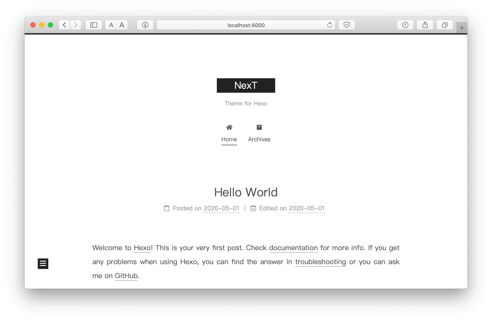

### 安装 Hexo

如果这是你第一次使用 Hexo，你可以花点时间来查看 如何安装 Hexo 和 初始化站点。

安装完成以后，你可以在命令行执行`hexo`（或`npx hexo`），在站点根目录中，有 package.json 文件、source 目录、themes 目录等其他目录。

```
cd hexo-site
ls
_config.yml  node_modules  package-lock.json  package.json  scaffolds  source  themes
```

### 配置

Hexo 使用两个主要配置文件，两者都称为：_config.yml。

- 第一个在网站根目录下，叫**站点配置文件**，其中包含 Hexo 的配置。
- 另一个在主题根目录下，叫**主题配置文件**，由 NexT 提供，包含主题的配置。

不建议直接修改 ，因为在将 NexT 升级到新版本，或需要手动合并配置时，会经常遇到冲突问题。为了解决这个问题，建议使用备用主题配置功能来配置 NexT 主题。

### 安装 NexT

下面是安装或升级主题的详细步骤。

#### 下载 NexT

下载 NexT 主题很简单：可以选择通过 npm 安装主题，或下载主题源代码并放置到网站根目录的 themes 目录下。


<!-- tab 使用 npm -->
如果你使用 Hexo 5.0 或更高版本，最简单的安装方法是通过 npm。

打开你的终端，切换到 Hexo 网站根目录并安装 NexT 主题：

```
cd hexo-site
npm install hexo-theme-next
```
<!-- endtab -->
<!-- tab 使用 git -->
如果你了解 [Git](https://mopsite.gitee.io/git)，你可以克隆整个仓库并随时使用`git pull`命令更新它。

打开你的终端，切换到 Hexo 网站根目录并克隆 NexT 主题的最新 master 分支：

```
cd hexo-site
git clone https://github.com/next-theme/hexo-theme-next themes/next
```
<!-- endtab -->


#### 升级 NexT

你可以通过以下命令更新 NexT。


<!-- tab 使用 npm -->
通过 npm 安装最新版本：

```
cd hexo-site
npm install hexo-theme-next@latest
```
<!-- endtab -->
<!-- tab 使用 git -->
或者更新到最新的 master 分支：

```
cd hexo-site
cd themes/next
git pull origin master
```
<!-- endtab -->


#### 启用 NexT

和所有 Hexo 主题一样，下载后打开 ，找到`theme`部分，并将其值更改为`next`。

```yml hexo/_config.yml
theme: next
```

#### 检查 NexT

现在你已经安装了 NexT 主题并启用了它，以下步骤将帮助你验证是否正确启用了 NexT。

建议先使用`hexo clean`清理 Hexo 的缓存。然后通过添加`--debug`调试参数启动 Hexo 本地服务器，整个命令是`hexo s --debug`，该命令运行时可以看到输出，如果发现问题，可以使用输出更好地定位错误：

```
hexo s --debug

INFO  Hexo is running at http://localhost:4000/. Press Ctrl+C to stop.
```

现在你可以在浏览器中打开 http://localhost:4000 ，并检查该站点是否正常工作。如果你发现你的网站看起来像下图，你已经正确安装好了。这是默认的 NexT 方案——Muse。



### Hexo 配置

 中的以下设置，对优化你的网站非常有帮助。

#### 配置作者

将  中的`author`选项值设置为你的昵称。

```yml hexo/_config.yml
# Site
author:
```

#### 配置描述

将  中的`description`选项值设置为网站的描述信息。

```yml hexo/_config.yml
# Site
description:
```

如果一切正常，在接下来的步骤中，我们将更改一些设置，包括 [个性化](/theme-settings) 和 [第三方服务集成](/third-party-services)。
