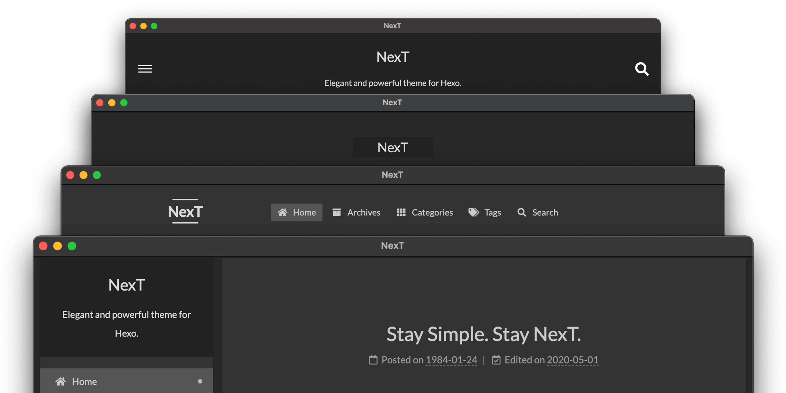

NexT 坚持将复杂的细节隐藏，提供尽量少并简便的设置，保持最大限度的易用性。

### 缓存支持

NexT 6 或更高版本允许生成缓存内容。将  中`cache`部分的`enable`值设置为 true：

```yml next/_config.yml
# 允许生成缓存内容。
cache:
  enable: true
```

### 缩小生成

NexT 支持缩小 HexT 的生成。将  中`minify`的值设置为 true：

```yml next/_config.yml
# Hexo 生成后移除不必要的文件。
minify: true
```

### 选择方案

方案（Scheme）是 NexT 提供的一种特性，借助于方案，NexT 可以你提供多种不同的外观。同时，几乎所有的配置都可以在方案之间共用。目前，NexT 支持四种方案，它们是：

- Muse → 默认方案，这是 NexT 的初始版本，使用黑白色调，看起来很干净。
- Mist → Muse 的紧凑版本，具有整洁有序的单栏外观。
- Pisces → 双栏方案，小家碧玉似的清新。
- Gemini → 看起来像 Pisces，但是带有明显的阴影。

### 深色模式



你可以通过设置  中的`darkmode`为 true 来启用深色模式。

```yml next/_config.yml
darkmode: true
```

如果操作系统首选主题为深色，那么 NexT 主题会自动显示为深色模式。macOS Mojave、iOS 13 和 Android 10 或更高版本都支持该功能。

### 网站图标

默认情况下，Hexo 站点使用 hexo-site/themes/next/source/images/ 目录下不同大小的 NexT 图标，你可以将它们替换为自己的网站图标。

例如，你可以将自己的图标放到 hexo-site/source/images 目录下，然后你需要重命名它们，并修改  中的`favicon`部分，否则 NexT 图标将会覆盖你在 Hexo 中的自定义图标。

你还可以将自定义图标放到 hexo-site/source/ 目录下，这样，你必须删除路径中的 /images 前缀。

要生成自定义图标，你可以访问 [Favicon Generator](https://realfavicongenerator.net/)。

```yml hexo/_config.yml
favicon:
  small: /images/favicon-16x16-next.png
  medium: /images/favicon-32x32-next.png
  apple_touch_icon: /images/apple-touch-icon-next.png
  safari_pinned_tab: /images/logo.svg
  android_manifest: /images/manifest.json
```

### 自定义 logo

NexT 支持网站的个性化 logo。你可以通过将图像的 url 添加到  中的`custom_logo`选项来启用它。

```yml next/_config.yml
custom_logo: /uploads/custom-logo.jpg
```


Mist 方案不支持设置自定义 logo。


### 知识共享

NexT 支持在侧边栏和文章中显示 [知识共享 4.0 国际许可](https://creativecommons.org/)，包括 by、by-nc、by-nc-nd、by-nc-sa、by-nd、by-sa 和 cc-zero。

你可以通过编辑  中`creative_commons`部分的值来配置知识共享，例如：

```yml next/_config.yml
creative_commons:
  license: by-nc-sa
  size: small
  sidebar: true
  post: true
  language: deed.zh
```

### 菜单导航

菜单导航设置项的格式为`key: /link/ || icon`，其中包含 3 个值：



<!-- tab key -->

`key`是菜单项的名称（首页、归档等）。如果在 next/languages/ 文件夹对应的语言文件中找到该菜单的翻译，则使用此翻译；如果没有，将使用`key`作为菜单项的名称。


`key`值区分大小写（例如 home 与 Home 不同）。


<!-- endtab -->
<!-- tab link -->

`link`在分隔符`||`之前，是相对于你站点链接的相对链接。

<!-- endtab -->
<!-- tab icon -->

`icon`在分隔符`||`之后，是 [Font Awesome](https://mopsite.gitee.io/fontawesom) 图标的名称。

<!-- endtab -->



默认情况下，所有的菜单项都被注释掉了，是为了确保你可以在备用主题配置中覆盖它们。

要自定义菜单项，请在  中编辑以下内容：

```yml next/_config.yml
menu:
  home: / || fa fa-home
  #about: /about/ || fa fa-user
  #tags: /tags/ || fa fa-tags
  #categories: /categories/ || fa fa-th
  archives: /archives/ || fa fa-archive
  #schedule: /schedule/ || fa fa-calendar
  #sitemap: /sitemap.xml || fa fa-sitemap
  #commonweal: /404/ || fa fa-heartbeat
```


除了首页和归档，`menu`下的所有自定义页面都需要手动创建。此外，站点地图页面（sitemap）需要 [hexo-generator-sitemap](https://github.com/hexojs/hexo-generator-sitemap) 插件支持。


此外，NexT 还支持层次结构下的动态子菜单。可以像下面这样，在  中的`menu`选项中添加你的子菜单项：

```yml next/_config.yml
menu:
  home: / || fa fa-home
  archives: /archives/ || fa fa-archive
  Docs:
    default: /docs/ || fa fa-book
    Getting Started:
      default: /getting-started/ || fa fa-flag
      Installation: /installation.html || fa fa-download
      Configuration: /configuration.html || fa fa-wrench
    Third Party Services:
      default: /third-party-services/ || fa fa-puzzle-piece
      Math Equations: /math-equations.html || fa fa-square-root-alt
      Comment Systems: /comments.html || fa fa-comment-alt
```


每个子菜单项都需要一个 default 页面。


默认情况下，NexT 不显示菜单项中的`badges`图标。


<!-- tab icon -->
你可以通过编辑  中的`menu-settings.icons`选项来决定是否显示菜单项的图标：

```yml next/_config.yml
menu_settings:
  icons: true
```
<!-- endtab -->
<!-- tab badges -->
将  中`menu-settings.badges`的值设为 true，可以在菜单项中显示文章、分类或标签的数量：

```yml next/_config.yml
menu_settings:
  badges: true
```
<!-- endtab -->

